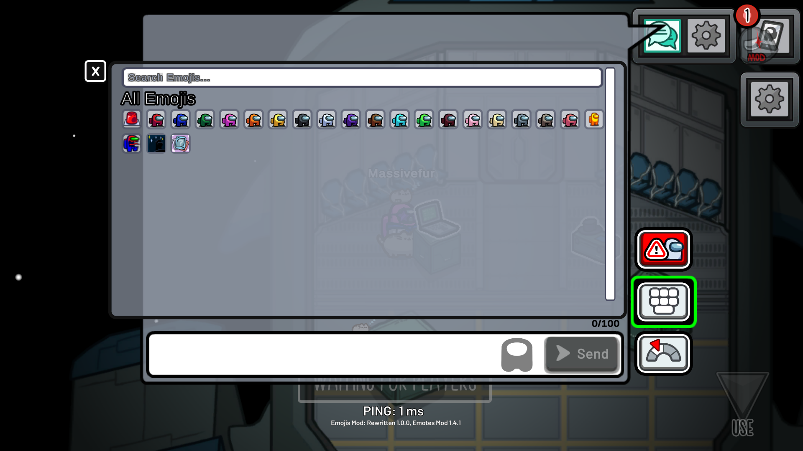
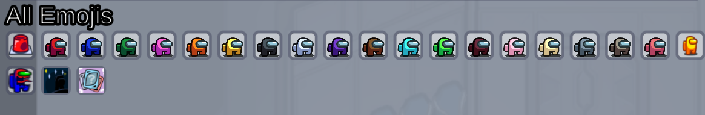

# Emojis Mod: Rewritten
An Among Us Mod that allows you to create your own emojis and use them in chat!

# How to use the mod:
You must first install the dll in `Releases`, then put it in your `Plugins` directory, launch the game once for the necessary directories to be created.
Afterwards, you must go to your among us install location, you should find an `Emojis` folder, you can put as many images as you wish, and restart the game so they're turned into emojis!

# Player-shaded emojis:
The mod allows you to define emojis that show up in every player character color, to do so, you must name your file with the prefix `playershader_`!
